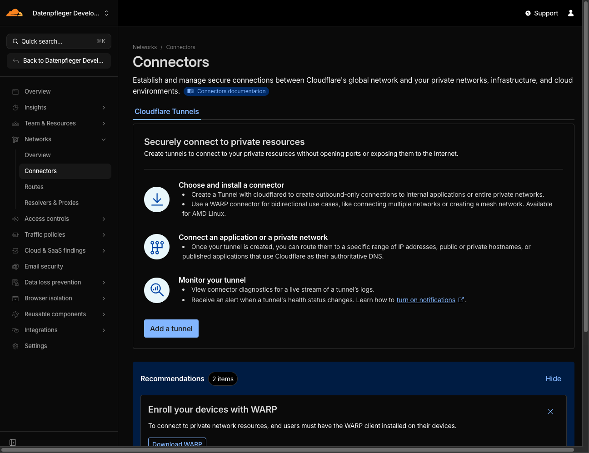
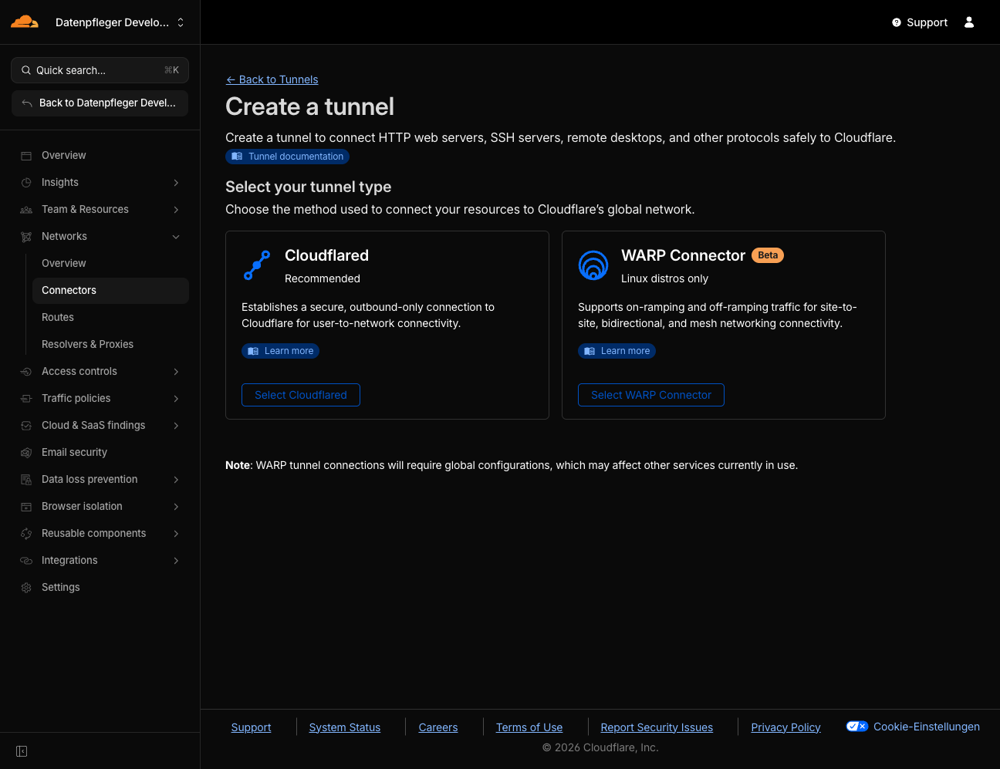
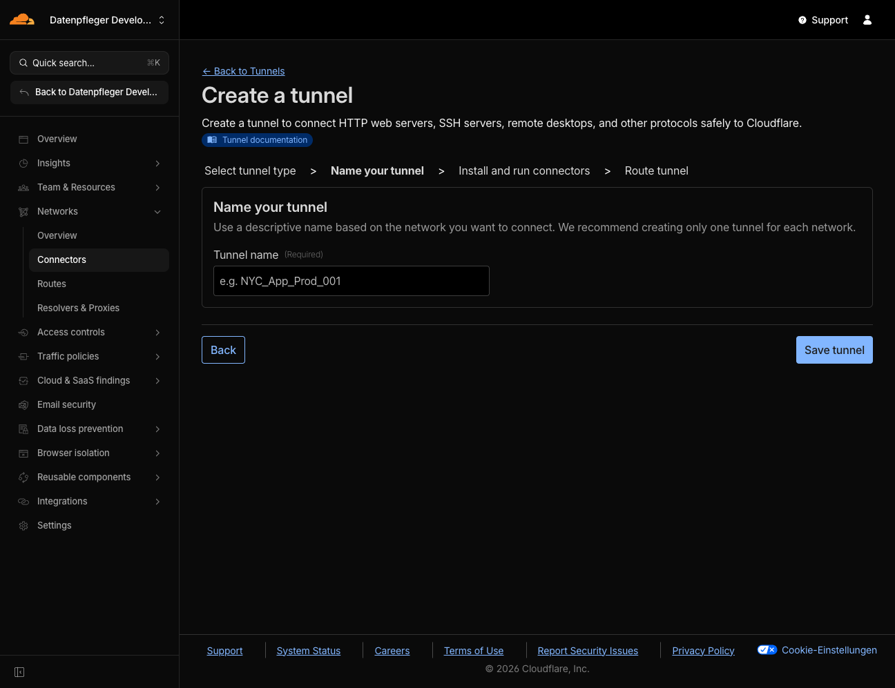
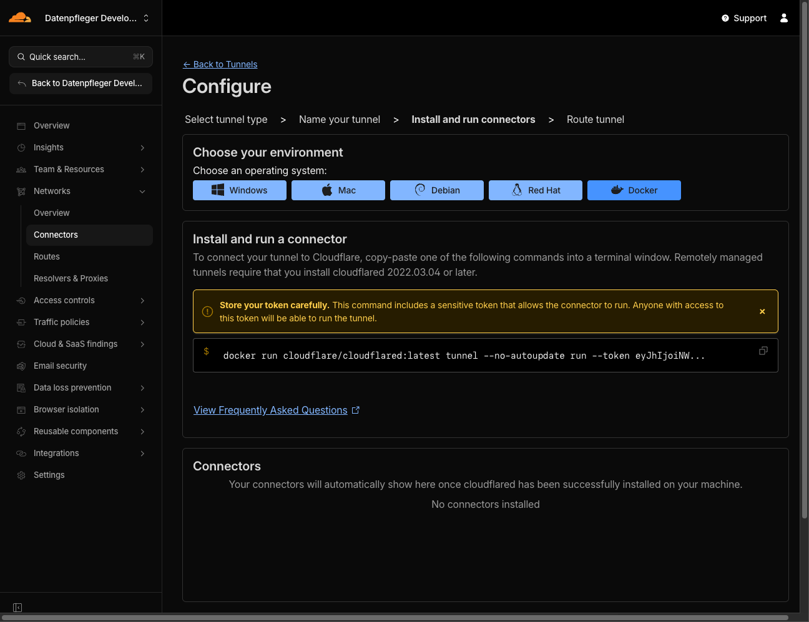

# Zero Trust Network Access mit Docker

Willkommen zum Praxis-Workshop! In diesem Lab implementieren wir eine moderne Sicherheitsarchitektur. Anstatt klassische VPNs und Port-Forwarding zu nutzen, werden wir eine interne Anwendung über einen Cloudflare Tunnel veröffentlichen und mittels Zero Trust Policies absichern.

## Lernziele

- Unterschied zwischen Perimeter-Sicherheit und Zero Trust verstehen
- Docker-basierten "Hidden Service" bereitstellen (ohne offene Ports)
- Cloudflare Tunnel zur sicheren Veröffentlichung einrichten
- Zugriffsregeln basierend auf Identität und Geografie konfigurieren
- Sicherheits-Header (JWT) im Browser analysieren

## Voraussetzungen

- [Docker Desktop](https://www.docker.com/products/docker-desktop/) installiert und laufend
- Aktives [Cloudflare Konto](https://dash.cloudflare.com/sign-up) (Free Tier reicht aus)
- Eine Domain, die über Cloudflare verwaltet wird (aktive DNS-Zone)

## Architektur

```
┌─────────────┐      ┌──────────────────┐      ┌─────────────────┐
│   Browser   │─────▶│  Cloudflare Edge │─────▶│  Docker Host    │
│  (Student)  │ TLS  │  (Access Policy) │Tunnel│  ┌───────────┐  │
└─────────────┘      └──────────────────┘      │  │cloudflared│  │
                            │                  │  └─────┬─────┘  │
                     ✓ Identity Check          │        │        │
                     ✓ Geo Check               │  ┌─────▼─────┐  │
                     ✓ JWT Injection           │  │internal-app│  │
                                               │  └───────────┘  │
                                               └─────────────────┘
```

**Wichtig:** Es werden keine Ports geöffnet! Der Traffic fliesst ausschliesslich über den ausgehenden Tunnel.

---

## Schritt 1: Cloudflare Tunnel vorbereiten

Wir nutzen das Cloudflare "Zero Trust Dashboard" zur Konfiguration.

### 1.1 Zum Zero Trust Dashboard navigieren

1. Melden Sie sich im [Zero Trust Dashboard](https://one.dash.cloudflare.com/) an
2. Navigieren Sie in der linken Sidebar zu **Networks** > **Connectors**



### 1.2 Tunnel erstellen

3. Klicken Sie auf **Add a tunnel**
4. Wählen Sie **Cloudflared** (Recommended) und klicken Sie **Select Cloudflared**



5. Geben Sie dem Tunnel einen Namen (z.B. `lab-tunnel-01`) und klicken Sie **Save tunnel**



### 1.3 Token kopieren

6. Im Fenster "Install and run a connector":
   - Wählen Sie oben **Docker** als Betriebssystem
   - Sie sehen einen Docker-Befehl wie diesen:



```
docker run cloudflare/cloudflared:latest tunnel --no-autoupdate run --token eyJhIjoiNWY4OD...
```

7. **Kopieren Sie NUR den Token** (der lange String nach `--token`, beginnend mit `eyJ...`)

---

## Schritt 2: Docker Umgebung starten

### 2.1 System prüfen (optional)

```bash
# Linux/Mac
./scripts/check.sh

# Windows PowerShell
.\scripts\check.ps1
```

### 2.2 Token konfigurieren

Hier fügen Sie das Token ein, das Sie in **Schritt 1.3** aus dem Cloudflare Dashboard kopiert haben.

**1. Template-Datei kopieren:**

```bash
cp .env.example .env
```

**2. Token in die `.env` Datei einfügen:**

Öffnen Sie die `.env` Datei mit einem Texteditor:

```bash
# macOS/Linux
nano .env
# oder
code .env    # falls VS Code installiert ist

# Windows (PowerShell)
notepad .env
```

**3. Token eintragen:**

Ersetzen Sie `your-token-here` mit Ihrem kopierten Token:

```bash
# VORHER:
TUNNEL_TOKEN=your-token-here

# NACHHER (Beispiel):
TUNNEL_TOKEN=eyJhIjoiNWY4ODEzNDRjNmEwZjdmZjhmMGE1Nzc1MGNjYTcy...
```

**Wichtig:**
- Kopieren Sie **nur** den Token-String, nicht den gesamten Docker-Befehl
- Der Token beginnt immer mit `eyJ` (Base64-kodiertes JSON)
- Keine Anführungszeichen um den Token setzen
- Keine Leerzeichen vor oder nach dem `=`

### 2.3 Container starten

```bash
docker compose up -d
```

### 2.4 Status prüfen

```bash
# Container-Status
docker compose ps

# Tunnel-Logs (Ctrl+C zum Beenden)
docker compose logs -f tunnel
```

Sie sollten Meldungen sehen wie:
```
Connection... registered connIndex=0 location=ZRH
```

Das bedeutet: Der Tunnel ist aktiv und mit der Cloudflare Edge verbunden!

---

## Schritt 3: Routing und Zugriffsschutz

Der Tunnel steht, aber Cloudflare weiss noch nicht wohin der Traffic soll. Wir konfigurieren jetzt **gleichzeitig** das Routing und den Zugriffsschutz.

### 3.1 Public Hostnames erstellen

Wir erstellen **zwei** Public Hostnames: einen für die whoami-App und einen für die Gruppen-Seite.

1. Gehen Sie zurück zum Cloudflare Dashboard (wo Sie das Token kopiert haben)
2. Klicken Sie auf **Next** (unten)
3. Im Tab **Public Hostnames** klicken Sie **Add a public hostname**

**Hostname 1: Whoami-App (Debugging)**

| Feld | Wert |
|------|------|
| Subdomain | `secure` (oder ein Name Ihrer Wahl) |
| Domain | Ihre Domain aus der Liste |
| Service Type | `HTTP` |
| URL | `internal-app:80` |

4. Klicken Sie **Save hostname**

**Hostname 2: Gruppen-Seite (Bearbeitbar)**

5. Klicken Sie erneut **Add a public hostname**

| Feld | Wert |
|------|------|
| Subdomain | `page` (oder z.B. `gruppe01`) |
| Domain | Ihre Domain aus der Liste |
| Service Type | `HTTP` |
| URL | `group-page:80` |

6. Klicken Sie **Save hostname**

### 3.2 Access Policy erstellen

**Wichtig:** Erstellen Sie die Policy SOFORT, bevor Sie die URL testen!

1. Navigieren Sie zu **Access** > **Applications**
2. Klicken Sie **Add an application**
3. Wählen Sie **Self-hosted**
4. Konfiguration:

| Feld | Wert |
|------|------|
| Application name | `Lab Internal App` |
| Session Duration | `24 hours` |
| Application domain | `secure.ihre-domain.com` (exakt wie oben) |

5. Klicken Sie **Next**
6. Policy erstellen:

| Feld | Wert |
|------|------|
| Policy Name | `Allow Team` |
| Action | `Allow` |

7. Unter **Configure rules**:
   - **Selector:** `Emails`
   - **Value:** Ihre E-Mail-Adresse

8. Optional - Geo-Blocking hinzufügen:
   - Klicken Sie **+ Add require**
   - **Selector:** `Country`
   - **Value:** `Germany` (oder Ihr aktuelles Land)

9. Klicken Sie **Next** und dann **Add application**

---

## Schritt 4: Verifizierung

1. Öffnen Sie ein **Inkognito/Privates Fenster** im Browser
2. Rufen Sie `https://secure.ihre-domain.com` auf
3. Sie sollten den **Cloudflare Access Login** sehen
4. Geben Sie Ihre E-Mail-Adresse ein
5. Prüfen Sie Ihren Posteingang auf den **6-stelligen Code** (OTP)
6. Geben Sie den Code ein

### Erfolgs-Check

Nach dem Login sehen Sie die Ausgabe der `whoami`-App. Suchen Sie nach:

```
Cf-Access-Jwt-Assertion: eyJhbGciOiJSUzI1...
```

**Das ist der Beweis!** Cloudflare hat Ihre Identität geprüft und diesen kryptografischen Token an die App weitergeleitet. Die App weiss nun wer Sie sind - ohne eigene Login-Datenbank.

---

## Schritt 5: Gruppen-Seite anpassen

Neben der whoami-App haben Sie auch eine eigene **bearbeitbare Webseite**. Diese können Sie individuell gestalten!

### 5.1 HTML-Datei öffnen

Öffnen Sie die Datei `html/index.html` im Projektordner mit einem Texteditor:

```bash
# macOS/Linux
nano html/index.html
# oder
code html/index.html    # VS Code

# Windows
notepad html\index.html
```

### 5.2 Inhalte anpassen

Suchen Sie nach den markierten Stellen im HTML:

```html
<!-- ========================================= -->
<!-- HIER GRUPPENNUMMER ANPASSEN (z.B. 01)    -->
<!-- ========================================= -->
<h1>Gruppe XX</h1>
```

Ändern Sie `Gruppe XX` zu Ihrer Gruppennummer, z.B. `Gruppe 03`.

### 5.3 Änderungen ansehen

1. Speichern Sie die Datei
2. Öffnen Sie `https://page.ihre-domain.com` im Browser
3. Falls nötig, laden Sie die Seite neu (F5 oder Ctrl+R)

**Tipp:** Sie können beliebig Text hinzufügen, Überschriften ändern oder neue Abschnitte erstellen. Die Änderungen sind sofort sichtbar!

---

## Aufräumen

### Lokale Umgebung stoppen

```bash
docker compose down
```

### Cloudflare Dashboard aufräumen

1. **Access** > **Applications** > Ihre App löschen
2. **Networks** > **Tunnels** > Ihren Tunnel löschen

---

## Troubleshooting

Bei Problemen siehe [FEHLERSUCHE.md](FEHLERSUCHE.md).

**Häufige Probleme:**
- 502 Bad Gateway → URL im Dashboard prüfen (`internal-app:80` nicht `localhost`)
- Container startet nicht → Token in `.env` prüfen
- Keine OTP E-Mail → Spam-Ordner prüfen

---

## Weiterführende Informationen

- [Cloudflare Zero Trust Dokumentation](https://developers.cloudflare.com/cloudflare-one/)
- [Cloudflare Tunnel Docs](https://developers.cloudflare.com/cloudflare-one/connections/connect-networks/)
- [traefik/whoami auf Docker Hub](https://hub.docker.com/r/traefik/whoami)
